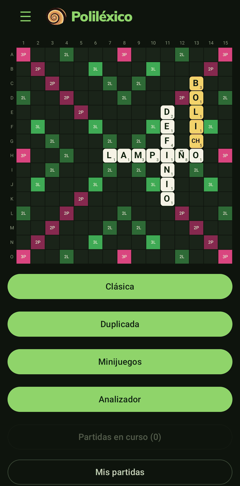
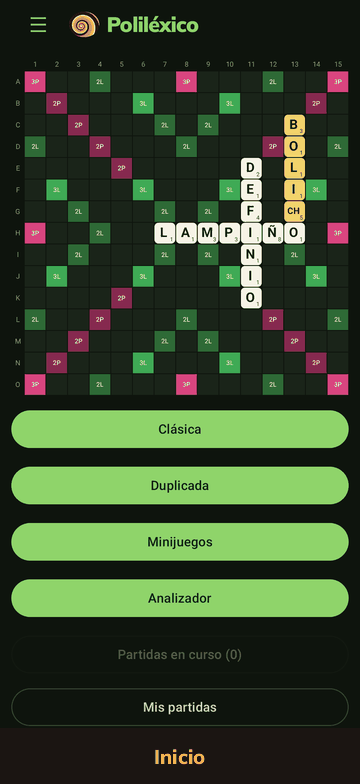

<p align="center">
  
</p>

<h1 align="center">Poliléxico</h1>

<p align="center">
  <b>Scrabble en español, sin conexión.</b><br>
  Clásica y duplicada con todas sus reglas, tres minijuegos y un analizador.
</p>

<p align="center">
  <a href="../../releases/latest"></a>
</p>

<p align="center">
  
  
  
  
</p>

*Offline Spanish-language Scrabble for Android.*

## Qué trae

- **Clásica** contra cinco rivales, de Polimita a Gitana, con o sin tiempo.
- **Duplicada** con las reglas oficiales y análisis de partida.
- **Minijuegos**: ¿Cuántas recuerdas?, Finales y Scrabble Sprint.
- **Analizador**: cualquier posición, con sus mejores jugadas, sus puntos y su equity.
- Cuatro temas, y todo sin conexión y sin cuentas.

<p align="center">
  
</p>

El recorrido completo, con más capturas: [docs/FEATURES.md](docs/FEATURES.md).

El motor de juego es [Macondo](https://github.com/domino14/macondo), de Woogles.io.

## Descarga

Los APK están en [Releases](../../releases). Van firmados con este certificado (SHA-256), que se
puede comprobar con `apksigner verify --print-certs` o con AppVerifier:

```
37:84:CA:E1:68:0B:BA:D4:6C:F5:38:B2:B0:72:D4:5F:D5:86:19:14:61:23:21:B0:0D:33:0D:87:73:B0:C9:F6
```

## Compilar

```bash
git clone --recurse-submodules <url>
cd android
source ../env.sh
./gradlew :engine-bridge:assembleDebug     # el motor
./gradlew :app:assembleDebug               # → app/build/outputs/apk/debug/
./gradlew :app:assembleRelease             # → app/build/outputs/apk/release/
```

`env.sh` busca el SDK y el NDK de Android, Go y gomobile en `../Android`; para usar otra ruta,
`export LEXICO_ENV=/ruta` antes del `source`. El APK de release se firma con
`android/keystore.properties`; sin ese archivo, sale sin firmar. Más detalles en
[android/README.md](android/README.md).

## Licencia

© 2026 Davier Bello. GPL-3.0-or-later, con los [términos adicionales](ADDITIONAL_TERMS.md) que
permite su sección 7.
