# Funcionalidades de Poliléxico

Poliléxico es Scrabble en español, sin conexión: clásica contra bots, duplicada con las reglas
oficiales, tres minijuegos y un analizador. El motor es [Macondo](https://github.com/domino14/macondo),
de Woogles.io.

  
  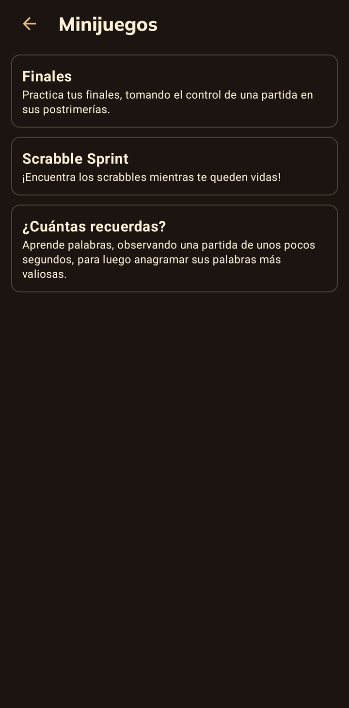

## Clásica

Una partida contra un bot. Hay cinco rivales, de menos a más fuertes: Polimita, Sancho, Pelusa,
María M. y Gitana.

Al terminar la partida, se puede analizar jugada a jugada: el tablero de cada turno, lo que jugó
cada uno y las mejores jugadas posibles.

  
  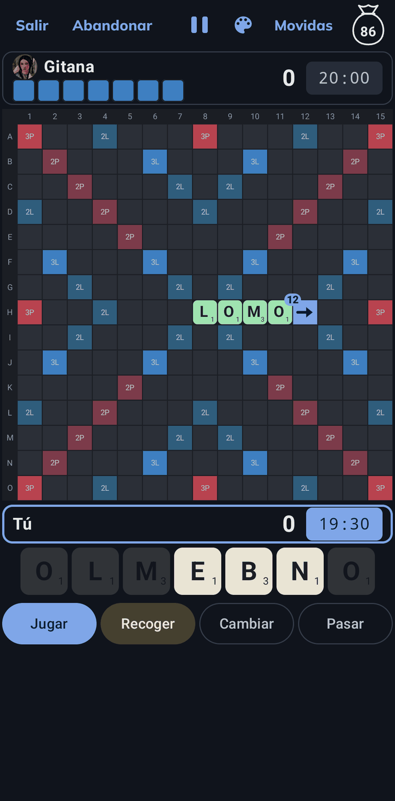
  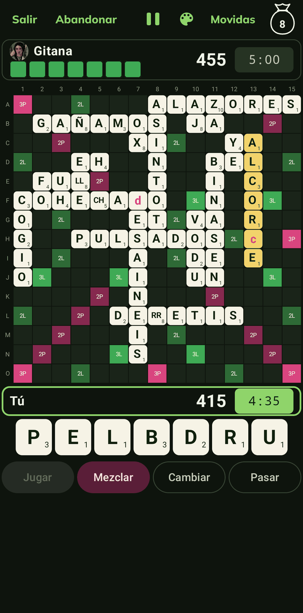
  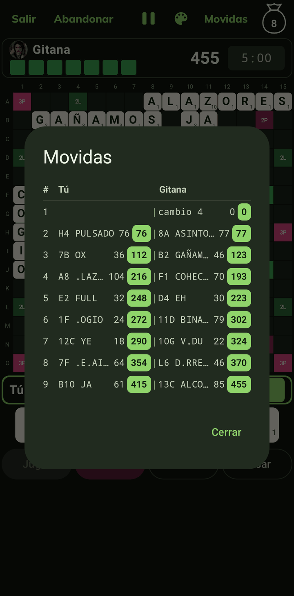

## Duplicada

Duplicada con las reglas oficiales. Al terminar la partida, también se puede analizar jugada a
jugada.

  
  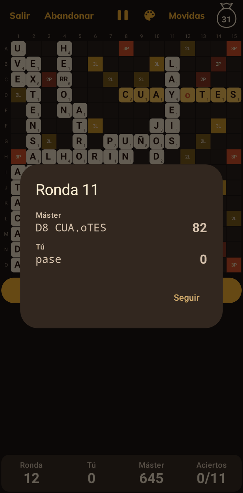
  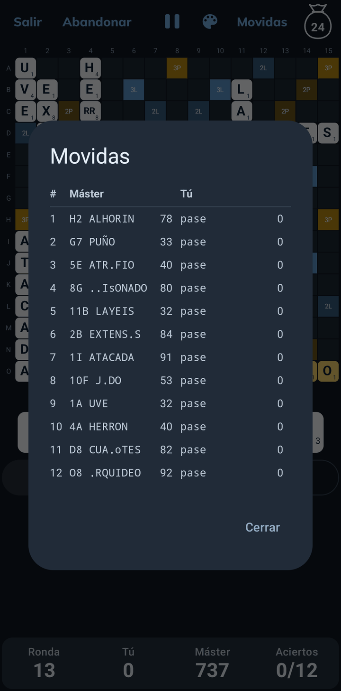

## Minijuegos

- **Finales**: una partida ya avanzada, con pocas fichas en la bolsa, que el jugador termina contra
  Gitana. Se elige cuántas fichas quedan y la ventaja con la que se empieza, a favor del jugador o
  del rival.
- **Scrabble Sprint**: cada mano tiene un scrabble posible, que hay que encontrar antes de que se
  agote el reloj. Hay de una a cinco vidas: rendirse en una mano cuesta una y, en *single*, poner
  una palabra no válida también. Mientras se juega, se ve el récord a batir con esas opciones.
- **¿Cuántas recuerdas?** Se ve una partida durante unos pocos segundos y luego hay que armar, con
  sus letras, las palabras que más puntos hicieron. Mientras menos tiempo, más difícil recordar.
  Se juega partida tras partida hasta quedarse sin vidas: cada palabra no recordada cuesta una, y
  en *single* también poner una palabra no válida. Se guarda el récord de palabras recordadas con
  esas opciones.

  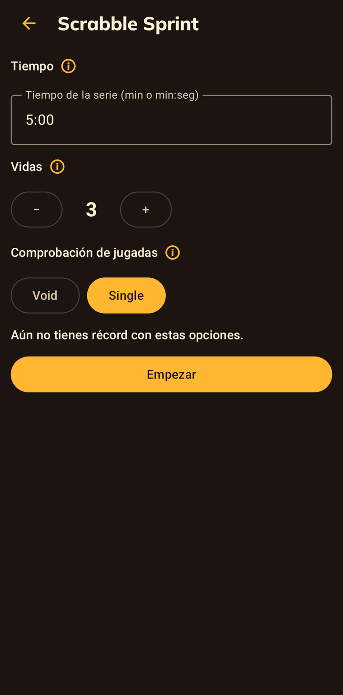
  
  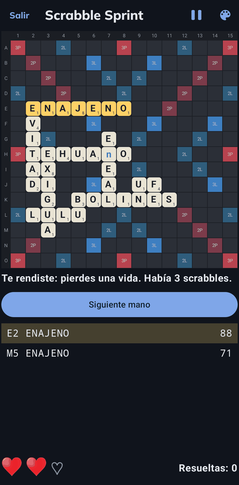

  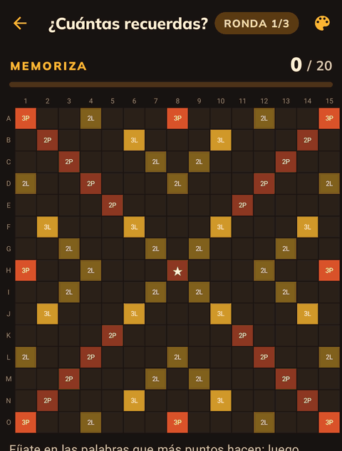
  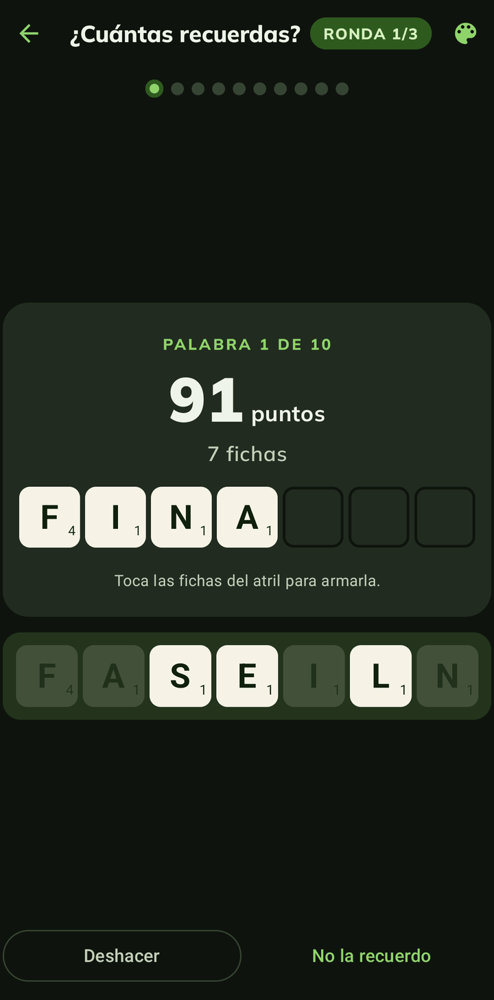

## Analizador

Un tablero libre: se ponen las fichas que se quiera, en el tablero o en el atril, y el motor
muestra las mejores jugadas, con sus puntos y su **equity**: el valor de la jugada considerando su
puntuación y lo que queda en la mano. Al tocar una, se dibuja en el tablero.

  

## Mis partidas

- **Partidas en curso**: se guardan tras cada jugada; se pueden dejar y seguir después.
- **Mis partidas**: las terminadas, en una carpeta por modo. Cada una se puede revisar turno a turno:
  el tablero de ese momento, lo que jugó cada uno y las mejores jugadas posibles (en duplicada,
  sin equity: allí solo cuentan los puntos).

  

## Mis estadísticas

Por modo y por rival: victorias, promedio de puntos, puntuación máxima, scrabbles y la palabra más
valiosa. En duplicada, además, la efectividad y los aciertos. Un gráfico enfrenta los puntos del
jugador con los del rival en cada partida; al tocar un punto, se abre esa partida.

  

## Temas

Cuatro esquemas de color, cada uno con su tablero: Polimita, Hoja, Celeste y Noche. El tema de la
app se elige en el menú lateral; en una partida contra un rival se usa el de ese rival, y también
se puede cambiar desde la partida.

  
  
  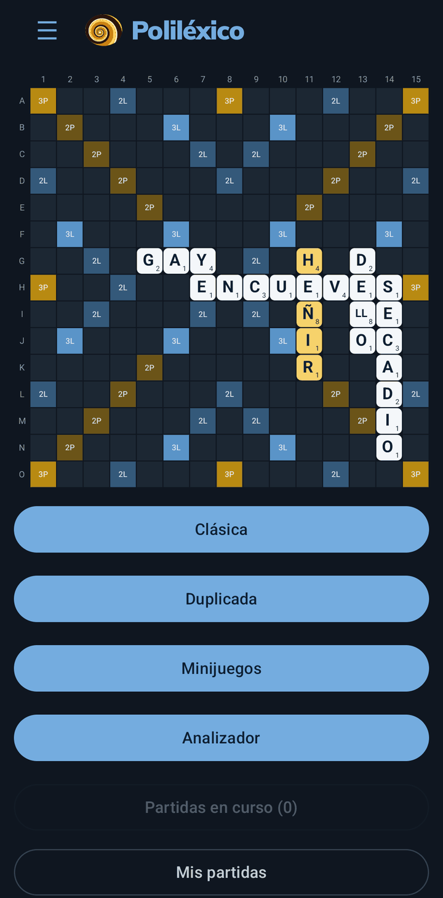
  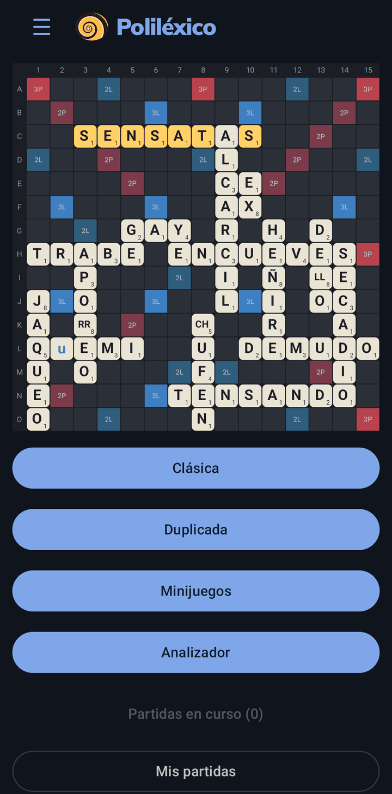

## Opciones

En el menú lateral:

- **Contar los puntos al colocar**: mientras se colocan las fichas, el tablero muestra los puntos
  que valdría la jugada.
- **Mostrar las letras faltantes**: en la clásica, al tocar la bolsa se ven las fichas que el
  jugador aún no ha visto (la bolsa y el atril del rival); si se apaga, solo cuántas quedan.

  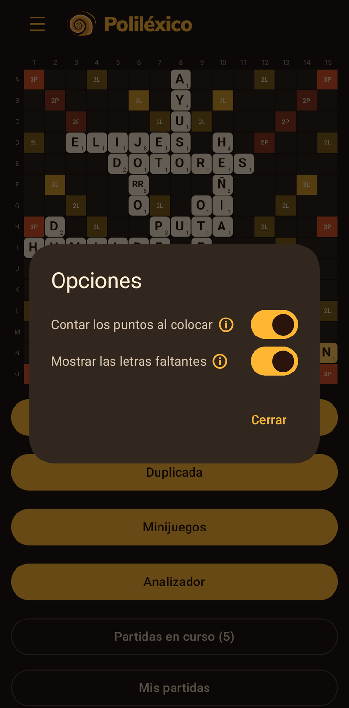
  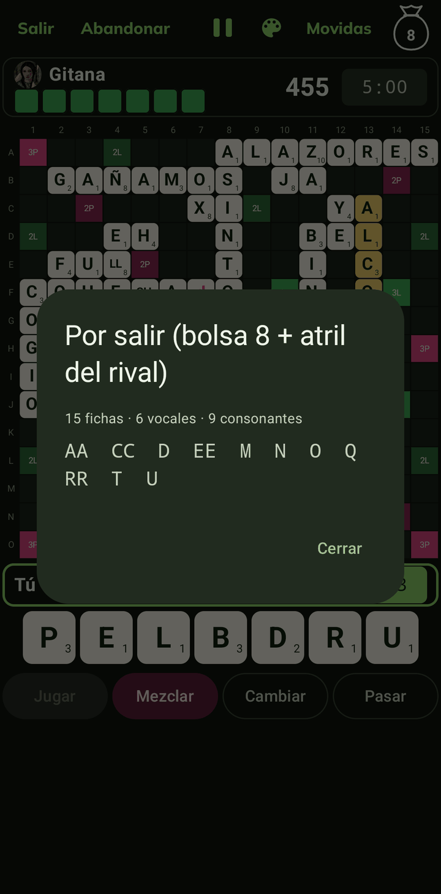

