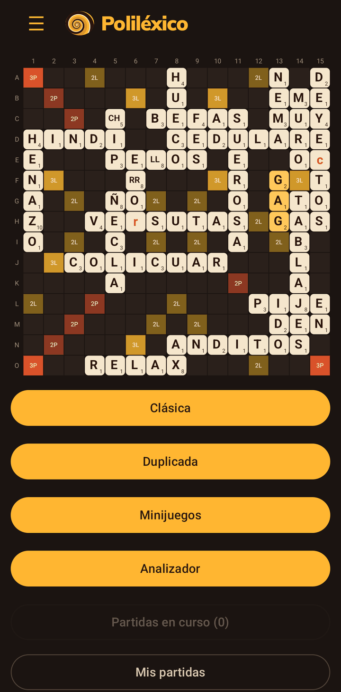
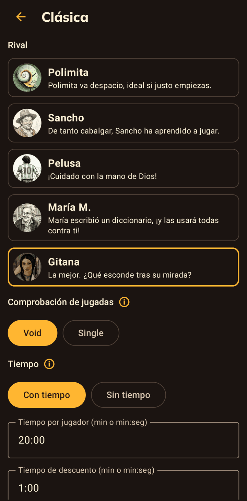
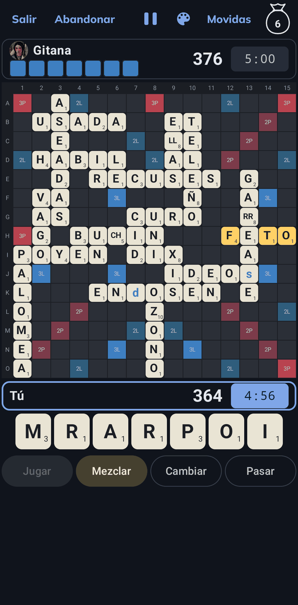
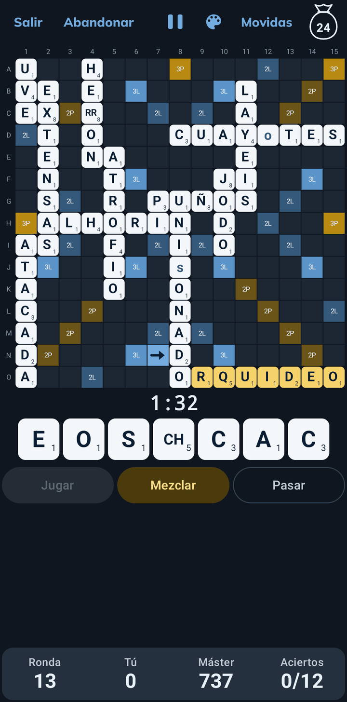
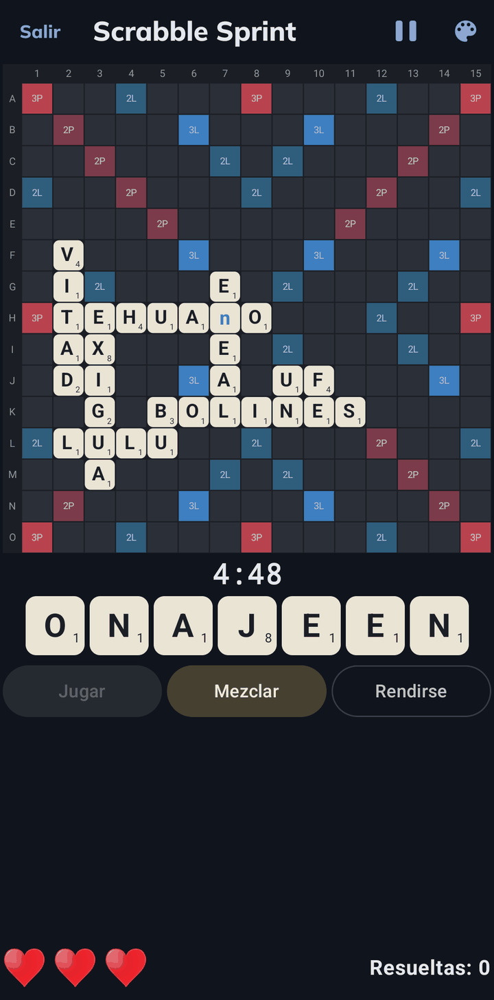
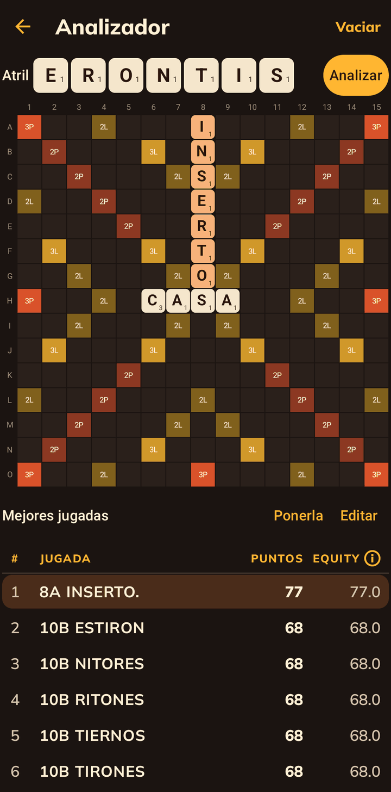

# Funcionalidades de Poliléxico

Poliléxico es Scrabble en español, sin conexión: clásica contra bots, duplicada contra el máster,
tres minijuegos y un analizador. El motor es [Macondo](https://github.com/domino14/macondo), de
Woogles.io, con el diccionario FILE2017.

  

## Clásica

Una partida contra un bot. Hay cinco rivales, de menos a más fuertes:

| Rival    | Nivel                                                      |
|----------|------------------------------------------------------------|
| Polimita | Va despacio, ideal si justo empiezas.                      |
| Sancho   | De tanto cabalgar, ha aprendido a jugar.                   |
| Pelusa   | ¡Cuidado con la mano de Dios!                              |
| María M. | Escribió un diccionario, ¡y usará todas las palabras contra ti! |
| Gitana   | La mejor. ¿Qué esconde tras su mirada?                     |

Antes de empezar se eligen:

- **Comprobación de jugadas**: *void* (el juego no deja poner palabras inválidas) o *single* (si
  pones una palabra inválida, la jugada no entra y pierdes el turno).
- **Tiempo por jugador**, con tiempo de descuento: si se acaba, pierdes por tiempo.

Durante la partida se puede ver la bolsa (las fichas que no has visto, o solo cuántas quedan),
pasar, cambiar fichas o rendirse.

  
  

## Duplicada

Todos los jugadores juegan con el mismo tablero y el mismo atril. En cada ronda juegas contra el
reloj; luego se pone en el tablero la mejor jugada posible (la del **máster**), y la partida
sigue con ella. Si no juegas a tiempo, ese turno sumas 0 puntos.

Al final se ve tu **efectividad** (tus puntos como porcentaje de los del máster) y tus
**aciertos** (los turnos en que hiciste los mismos puntos que el máster).

  

## Minijuegos

- **¿Cuántas recuerdas?** Ves una partida durante unos pocos segundos y luego armas, con sus
  letras, las palabras que más puntos hicieron. Mientras menos tiempo, más difícil recordar.
- **Finales**: se toma una partida ya avanzada, cuando quedan pocas fichas en la bolsa, y la
  terminas tú contra Gitana. Se elige cuántas fichas quedan y la ventaja con la que empiezas.
- **Scrabble Sprint**: cada mano tiene un scrabble posible; encuéntralo antes de que se agote el
  reloj. Tienes tres vidas, y rendirte en una mano cuesta una.

  
  

## Analizador

Un tablero libre: pones las fichas que quieras, en el tablero o en el atril, y el motor te dice
las mejores jugadas con la valoración de Woogles.

  

## Mis partidas

- **Partidas en curso**: se guardan tras cada jugada; se pueden dejar y seguir después.
- **Mis partidas**: las terminadas, en una carpeta por modo. Cada una se puede revisar turno a turno:
  el tablero de ese momento, lo que jugó cada uno y las mejores jugadas posibles.

  

## Mis estadísticas

Por modo y por rival: victorias, promedio de puntos, puntuación máxima, scrabbles y la palabra más
valiosa. En duplicada, además, la efectividad y los aciertos. Un gráfico enfrenta tus puntos con los del rival
en cada partida; al tocar un punto se abre esa partida.

  

## Opciones y temas

- **Contar los puntos al colocar**: mientras pones fichas, el tablero muestra los puntos que
  valdría la jugada.
- **Tema**: cuatro esquemas de color, cada uno con su tablero: Polimita, Hoja, Celeste y Noche.
